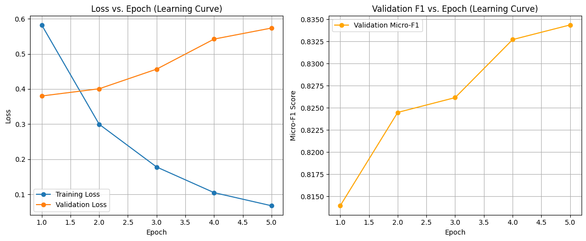
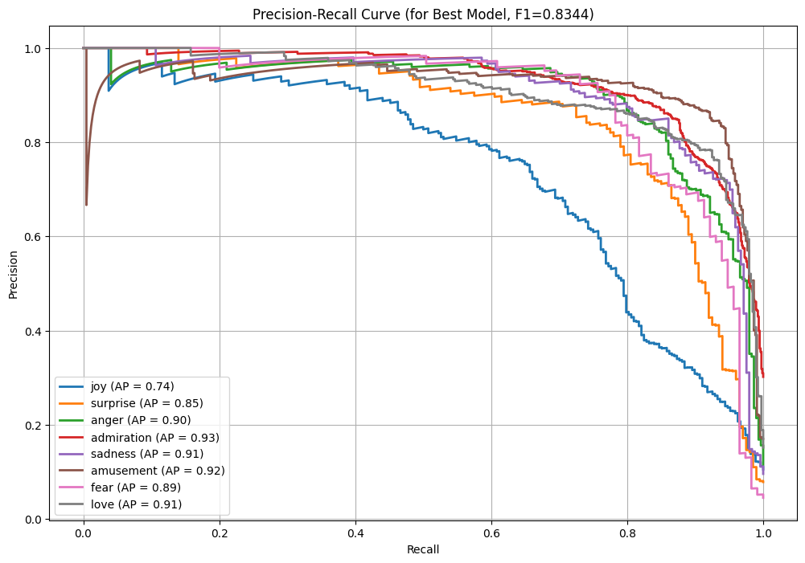

# Fine-Grained Emotion Detection with DistilBERT

Multi-label emotion classifier that detects **several emotions in the same sentence** — e.g. *"I'm nervous but excited"* → fear + joy — instead of collapsing everything into positive / negative / neutral.

Fine-tuned `distilbert-base-uncased` on the [GoEmotions](https://huggingface.co/datasets/go_emotions) dataset (≈58K Reddit comments), focused on 8 emotions: **joy, surprise, anger, admiration, sadness, amusement, fear, love**.

📄 **Paper:** [paper.pdf](paper.pdf) · 📓 **Code:** [emotion_detection.ipynb](emotion_detection.ipynb)

## Results

| Metric (validation set) | Score |
|---|---|
| Micro-F1 | **0.834** |
| Macro-F1 | 0.819 |

Per-emotion average precision ranges from 0.74 (joy) to 0.93 (admiration).




## What makes it work

The data is heavily imbalanced (admiration appears ~7× more often than fear), so a plain fine-tune over-predicts common emotions. Three changes address that:

1. **Class-balanced loss** — `BCEWithLogitsLoss` with `pos_weight` derived from label frequency, so rare emotions aren't drowned out.
2. **Two learning rates** — 5e-5 for the pre-trained DistilBERT backbone, 3e-4 for the new classification head, with cosine warmup. The head adapts quickly without wrecking pre-trained knowledge.
3. **Per-emotion thresholds** — instead of a flat 0.5 cut-off, each emotion gets its own decision threshold tuned on validation data (0.40–0.70).

Plus **multi-label stratified splitting** (`iterative-stratification`) so every split keeps the same emotion mix.

## Example predictions

```
"That jump scare really startled me"   → fear (100%)        · maybe surprise (46%)
"I can't stop laughing at this"        → amusement (99%)
"I'm so proud of you—amazing work!"    → admiration (100%)
"You are so sweet"                     → admiration (98%)  · maybe love (60%)
```

## Run it

```bash
pip install -r requirements.txt
jupyter notebook emotion_detection.ipynb
```

The dataset downloads automatically via Hugging Face `datasets`. Training (5 epochs, batch 16, max length 128) runs on CPU but is much faster on a GPU. The trained model is saved to `outputs/` (not committed).

## Limitations

- Validation loss starts rising after epoch 2 while F1 keeps improving — the model becomes over-confident, so earlier stopping or more regularization is worth trying.
- Results are on a held-out validation split, not a separate test set.
- Only 8 of GoEmotions' 27 labels are used, so scores aren't directly comparable to the full 27-label benchmark.

## Team

Course project for CSE 6363 Machine Learning, University of Texas at Arlington (2025), instructed by Dr. Jesús Gonzalez.

**Dimple Singh** · Aishwarya Kadam · Soudabeh Hedayati
